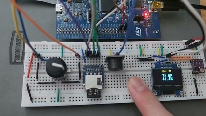
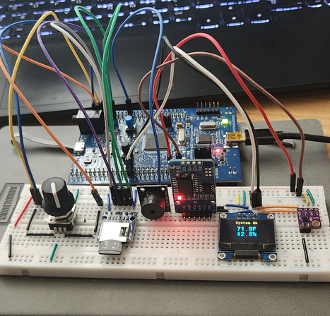
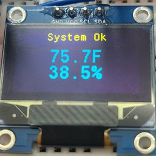
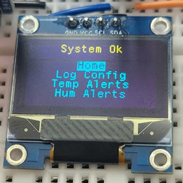
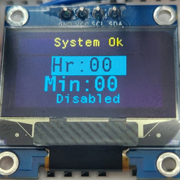

# Weather Station

This project is an embedded weather station built around an STM32F407-based development board. It measures temperature and humidity with a sensor, presents the data on an OLED display, and allows the user configure alert thresholds and logging settings through a simple menu system. The system also keeps time with an RTC and can store logged measurements to an SD card for later review.

I built this project as a hands-on way to learn embedded systems design from the ground up. It brought together low-level driver development, hardware communication over I2C and SPI, real-time UI handling, file system integration, and software architecture decisions that are common in firmware projects. What distinguishes this project is that it is not just a demo of a single sensor; it is a small but complete embedded system with multiple interacting modules.

---

## Demo Video
Click the thumbnail below to watch a 3-minute demonstration of the weather station's core functionality, including UI navigation, configurable alerts, SD card logging, and peripheral fault detection.

[](https://www.youtube.com/watch?v=XWI5tC8mv-U)

## Photos

### Assembled Hardware



### Home Screen
- Home screen for live weather data 



### Menu Screen
- Menu screen for navigation



### Config Screens
- Configuration screens for logging and alert settings
- Return to the main display after saving changes
- Other configuration screens are almost identical (just with different data to configure)




## Hardware Used
- STM32F407-based development board
- SHT31 temperature and humidity sensor
- SSD1306 OLED display
- DS3231 RTC
- SD card and module
- Rotary encoder
- Passive Buzzer

---

## Features

- Real-time temperature and humidity monitoring
- Health checks on I2C and SPI components
- OLED graphical interface with a menu-driven UI
- Rotary encoder-based navigation and input handling
- Configurable temperature and humidity alerts
- RTC-based timekeeping
- SD card data logging
- Modular C++ architecture for embedded firmware

---

## Unit Testing

The repository includes unit tests that verify business logic without requiring real hardware. These tests use mock classes to simulate hardware behavior, so they can be run entirely on your development machine.

To run the unit tests from the project root, use the following commands:

### macOS / Linux

```bash
mkdir -p build-tests
cd build-tests
cmake ..
make
ctest --verbose
```

### Windows

```powershell
cmake -S . -B build-tests
cmake --build build-tests
ctest --test-dir build-tests --output-on-failure --verbose
```

If your Windows setup uses a different generator (for example, MinGW or Ninja), you may need to specify it with the `-G` option when running `cmake`.

---

## Key Components

### Weather Station

The weather station gets weather data from the SHT31 sensor and, through the observer pattern, pushes the latest data to all observers. The observers are the user interface, the logger, and the alert system.

### Logger

The system logs readings to the SD card so data can be reviewed after collection. The logging logic is intended to be lightweight and deterministic, which is an important constraint in embedded firmware.

Logged measurements are written in the following format:
```text
07/08/26 17:59:47 - Temp: 77.0F Humidity: 42.1%
```
If the RTC is in a state of error, "Clock Error" will be logged in the place of the date and time. Similarly, if the weather sensor is in a state of error, "Sensor Error" will be logged in place of the weather data.

### Alert System
Each loop, the system evaluates temperature and humidity readings against configured max and min thresholds. If any of these thresholds are passed, the alarm system is triggered, sounding the passive buzzer alarm. The passive buzzer beeps in a pattern similar to that of an alarm clock, using an internal FSM to to determine when to start and stop.

### Health Checks
The program keeps track of which hardware components are healthy and which ones need troubleshooting. These health checks are runn on each I2C and SPI component (besides the OLED display), specifically, the SD Module, the RTC, and the weather sensor. Not checking the OLED display's health was a design choice made because if the OLED display is not working, there is nowhere to display error information.

As seen in the [User Interface Section](#user-interface) photos, when all components are up and running, the string "System Ok" is displayed on the header of each screen. If any components are unhealthy, the header will instead display "Err:", followed by the error code(s) representing the unhealthy component(s). The component to error code mapping is as follows:

- SD Module -> "Sd"
- DS3231 Clock -> "Cl"
- SHT31 Sensor -> "Se"

On startup, all 3 components are immediately checked. After that, the health of each one will be updated whenever that particular component is used. For example, the SHT31's health will update whenever it is polled for weather. If any components are in an error state, the user should first ensure that that component is correctly wired according to the 
[Hardware Wiring](#hardware-wiring) section.

The SHT31 and DS3231 can be disconnected and reconnected while the system is running. Their health status updates automatically, and normal operation resumes once communication is restored. On the other hand, a program reboot is required if the SD module is plugged in mid-program and logging is desired (unless it was already removed at startup. In this case, plugging it in will cause it to be successfully mounted, and it will show as healthy on the health check monitor). This is due to the mounting logic in the 3rd-party library not being reset if the module is removed after a successful mount.

---

## Software Architecture
- App/ contains the application logic, UI, services, models, and modules (my code along with integrated third-party display and SD drivers)
- Core/ contains the STM32 startup code and main entry point
- Drivers/ contains the HAL and peripheral support code
- FATFS/ contains the FatFS integration and SD card-related support
- Middlewares/ contains CubeMX-generated third-party libraries and middleware components

### /App Architecture Diagram

    High-Level Application Logic
    Services depend only on application interfaces
    ┌────────────────────────────────────────────────────────────┐
    │                        Services                            │
    │                                                            │
    │WeatherStation   Logger   AlertSystem   UIManager HealthSys |
    └──────────────────────────────┬─────────────────────────────┘
                                │
                                ▼
    Hardware Abstractions
    Modules implement the interfaces that the Services depend on
    ┌────────────────────────────────────────────────────────────┐
    │                        Modules                             │
    │                                                            │
    │  SHT31Sensor   DisplayEngine   Ds3231Clock   FileManager   │
    │                                                            │
    │  • Combine one or more drivers                             │
    │  • Implement application interfaces                        │
    │  • Hide hardware-specific behavior                         │
    └──────────────────────────────┬─────────────────────────────┘
                                │
                                ▼
    Low-Level Hardware Access
    Drivers perform register-level communication using the STM32 HAL
    ┌────────────────────────────────────────────────────────────┐
    │                        Drivers                             │
    │                                                            │
    │           SHT31   DS3231   SSD1306   SD SPI                │
    │                                                            │
    │  • Register-level communication                            │
    │  • HAL wrapper functions                                   │
    │  • Reusable across projects                                │
    └──────────────────────────────┬─────────────────────────────┘
                                │
                                ▼
    Hardware Abstraction Layer
    STM32 HAL Provides peripheral APIs used by the drivers
    ┌────────────────────────────────────────────────────────────┐
    │                       STM32 HAL                            │
    └──────────────────────────────┬─────────────────────────────┘
                                │
                                ▼
    ┌────────────────────────────────────────────────────────────┐
    │                        Hardware                            │
    │                                                            │
    │ STM32F407 • SHT31 • DS3231 • SSD1306 • SD Card • Encoder   │
    └────────────────────────────────────────────────────────────┘

---

## Design Decisions

Several design choices were made to keep the firmware predictable and suitable for embedded hardware:

- Dynamic memory allocation was avoided to eliminate heap fragmentation concerns and keep memory usage predictable.
- The code favors explicit state handling and small, focused components over overly abstract patterns
- Hardware interaction is separated from application logic so the system is easier to maintain
- The update loop is structured around periodic processing rather than heavy multitasking
- Sampling and UI refresh rates were chosen to balance responsiveness with stability

### Software Patterns Used
#### Observer Pattern
The observer pattern is the key overarching pattern used in this system. It helped the overall program to remain loosely coupled by allowing the subject (the WeatherStation class) to push its data to its observers (the UI, Logger, and AlertSystem classes) without either one knowing of the other's implementation details.

#### Template Method Pattern
The template method pattern was in the Screen class. This pattern minimized repeated code by allowing the base "Screen" class to define a template for rendering itself, and the derived classes to implement only the parts of that template that vary between them.

### Tradeoffs
#### Blocking I2C and SPI Calls
Rather than using DMA or interrupt-based I2C and SPI transfers, this project uses blocking HAL calls to reduce code complexity and improve maintainability. This application is not sufficiently time-critical for blocking transfers to negatively impact its functionality or responsiveness. The third-party libraries integrated into the project were also designed to use blocking HAL calls, and modifying them to support DMA or interrupt-driven communication would have significantly increased development time with little practical benefit.

#### Interrupts for the Rotary Encoder Driver
Because rotary encoder inputs can occur rapidly, interrupts were used instead of polling to ensure encoder events were not missed while the CPU was busy performing other tasks. Although this increased the complexity of the driver, polling would have resulted in a sluggish and unresponsive user interface. In this case, the improved responsiveness justified the additional implementation complexity.

---

## Challenges

This project presented several practical challenges that had to be addressed throughout development.

### Rotary Encoder Driver Implementation

Although it's relatively small, the rotary encoder driver proved to be the most difficult to implement. During my initial implementation, I observed seemingly random state transitions with the A/B pins when turning the rotary encoder, and struggled to get the driver to accurately determine the direction of rotation. After several lengthy debugging sessions using printf statements to track the A/B pin states, I was eventually able to identify a consistent three-state pattern that it transitioned through when turning each direction. I implemented the driver to check for both patterns on every interrupt. The resulting driver reliably detected the direction of each input.

### Interpreting Datasheets

The SHT31 sensor and the DS3231 RTC drivers in this project are custom and written by me. This required me to work through the datasheets for each device, which initially felt overwhelming. Both datasheets are 20+ pages long. One of the biggest challenges was learning to distinguish between information that was essential for implementing the driver and information that was simply background or reference material.

One thing in particular that threw me for a loop was how differently the two devices expose their functionality. For the SHT31, the master sends a measurement command and later reads back the result once the sensor has completed the measurement. I initially expected the DS3231 to work the same way. Instead, its datasheet describes a register map rather than a set of commands. The master simply writes the starting register address, which updates the RTC's internal register pointer, and then reads or writes as many consecutive bytes as needed. Looking back, the difference makes complete sense. The SHT31 performs measurements on demand, so it naturally exposes command-based operations. The DS3231, on the other hand, continuously maintains its internal state, so interacting with it is simply a matter of reading from or writing to the appropriate registers.

### Following Software Design Principles

Good, clean software design has always been important to me, but I found it increasingly difficult to follow all design principles as my project grew larger. There was one point in the development of my project where I noticed that the UIManager class was starting to do too much, badly violating the single responsibility principle. At that time, it was not only responsible for controlling the OLED display, but also for detecting and handling input (it held a reference to the rotary encoder), and even making configuration changes when the user submitted them. I eventually decided to delegate the input detection and configuration editing to the Application class. This improved separation of responsibilities. The Application class now had to know some of the UIManager's implementation details so that it could get the edited configurations and then save them to the appropriate service.

There were several other instances like this throughout the project where there was no single "correct" solution. Instead, I had to weigh competing design principles and choose the tradeoffs that best fit the project. That experience gave me a much better appreciation for how software architecture often involves balancing competing priorities rather than simply following a set of rigid rules.

---

## Key Takeaways

This project strengthened my understanding of embedded software development in a way that goes beyond writing a single driver. It showed how important interface design, timing, and hardware constraints are when building a complete system.

- Using one I2C bus for multiple components can drastically reduce the number of wires required
- Leveraging well-tested third-party libraries is often more practical than reimplementing commodity components.
- Being able to read and understand datasheets is a crucial part of building an embedded system
- Separation of concerns is key to creating a clean and maintainable codebase

---

## Build Instructions

The project is intended for STM32 development using the GNU Arm Embedded toolchain and STM32CubeIDE-style build flow.

### Recommended setup
- STM32CubeIDE
- STM32 HAL / CMSIS support files already included in the repository structure
- STM32F407-based board and the [Hardware](#hardware) listed above

### Build Steps
1. Clone the repo
2. Open the project in STM32CubeIDE
3. Build and flash the firmware by selecting ```Run``` -> ```Run As``` -> ```STM32 C/C++ Application```

## Hardware Wiring
### Rotary Encoder
- Output A -> PD9
- Output B -> PD11
- Switch (Push-button pin) -> PD12
- VCC -> 3.3V
- GND -> Ground

### SD Module (SPI)
- GND -> Ground
- MISO -> PB14
- CLK -> PB13
- MOSI -> PB12
- CS -> PB15
- 3v3 -> 3.3V

### Passive Buzzer
- GND -> Ground
- PWM -> PE9

### DS3231/SSD1306/SHT31 (Shared I2C Bus)
- VCC/VIN -> 3.3V
- GND -> Ground
- SCL -> PB6
- SDA -> PB7
- SHT31 AD -> Ground (For setting the sensor to the correct address)

---

## Drivers

A significant portion of this project consists of reusable low-level drivers for hardware peripherals. These drivers were written so that the application logic can remain focused on behavior rather than low-level register details.

### Custom Drivers (written by me)
- I2C-based SHT31 sensor
- I2C-based DS3231 RTC
- Rotary encoder for input handling
- Passive Buzzer for alert feedback

### Third-party drivers (integrated and lightly modified)
- SPI-based SD card access
- OLED display driver and framebuffer logic

The third-party drivers were incorporated into the project and modified where necessary to fit the application's architecture. The original source code for each can be found below. All application logic - including wrappers around the 3rd party drivers, hardware integration, and the custom drivers listed above were developed by me.

### External References
SHT31 datasheet - https://sensirion.com/media/documents/213E6A3B/63A5A569/Datasheet_SHT3x_DIS.pdf

DS3231 datasheet - https://www.analog.com/media/en/technical-documentation/data-sheets/ds3231.pdf

A tutorial page with downloadable source code for the OLED library - https://controllerstech.com/oled-display-using-i2c-stm32/

SD driver original repo - https://github.com/kiwih/cubeide-sd-card/blob/master/cubeide-sd-card/FATFS/Target/user_diskio_spi.c

---
